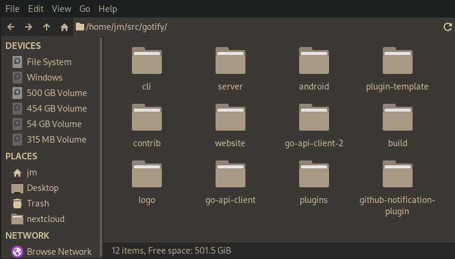
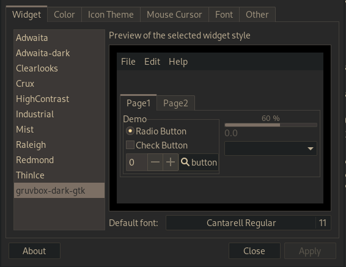
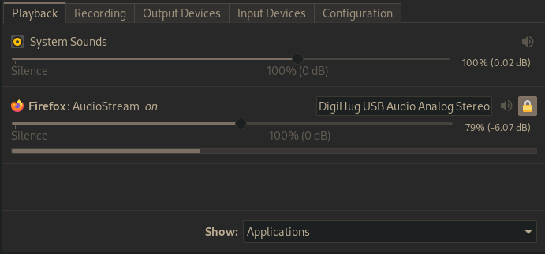

# jmattheis/gruvbox-dark-gtk

Created with https://github.com/themix-project/oomox

Used with https://github.com/jmattheis/gruvbox-dark-icons-gtk

## Install

nixos -> [gruvbox-dark-gtk](https://github.com/NixOS/nixpkgs/blob/master/pkgs/data/themes/gruvbox-dark-gtk/default.nix)

archlinux user repository -> [gruvbox-dark-gtk](https://aur.archlinux.org/packages/gruvbox-dark-gtk/)

### Manual

```bash
$ git clone https://github.com/jmattheis/gruvbox-dark-gtk ~/.themes/gruvbox-dark-gtk
```
Switch theme. (Can be done with lxappearance).

## Screenshots






